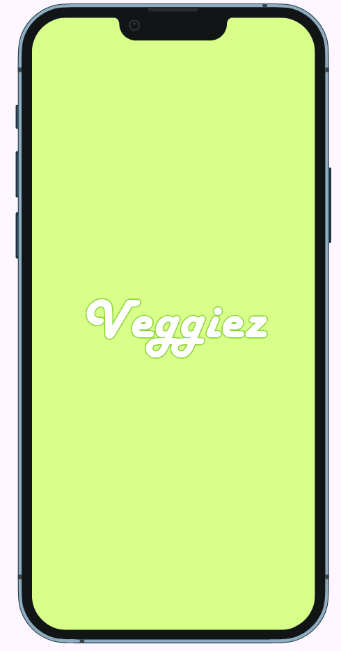
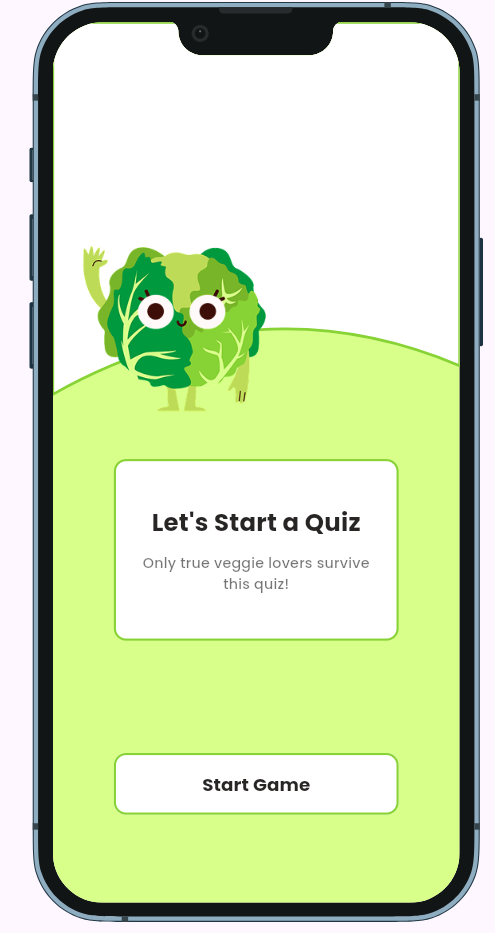
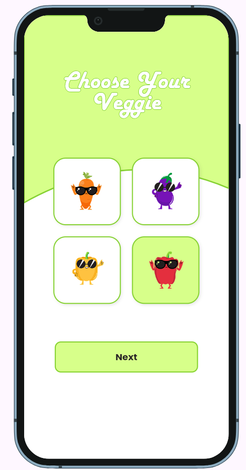
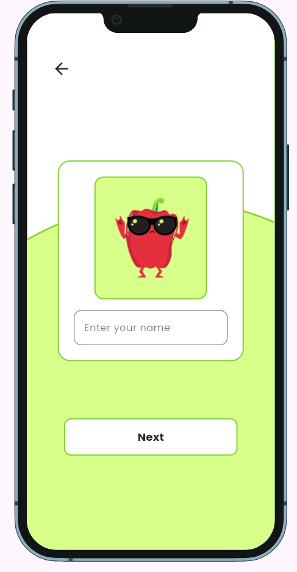
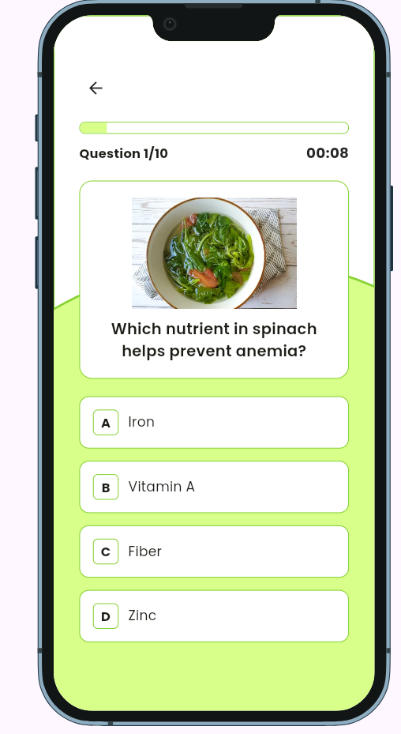
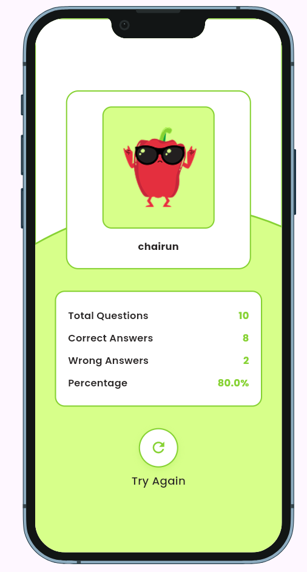

# Identitas

**Nama:** Chairun Nisaq  
**NIM:** 231401042  
**LAB:** 5

## **Nama Aplikasi:** Veggiez

**Veggiez** is a cheerful quiz app that helps users explore the world of vegetables through fun questions and charming visuals.

**Features**
1. Pick your favorite veggie character before starting the quiz!
2. Enter your name to personalize your quiz experience.
3. Answer multiple-choice questions with both text and images.
4. View your final score.
   This project is a starting point for a Flutter application.

# Assets
Assets foto diambil dari creator Shubuh Studio di Canva.

# Screenshoot aplikasi
|  |  |  |
|:------------------------:|:------------------------:|:------------------------:|
|  |  |  |

# Prototype
Akses prototype veggiez disini:
https://www.figma.com/proto/02i1pWQBFaLBkujTD5hIL8/uts-pemrograman-mobile?node-id=1-2&t=vEUsEirzDPq091Oj-1
